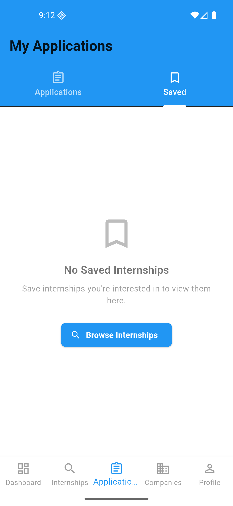

# 🎓 InTurn  

InTurn is a mobile app designed to help students and job seekers easily find internships and track their applications.  
Built with **Flutter** for the frontend and **Node.js/Express** for the backend, it provides a smooth experience for both companies and students.  

---

## 🚀 Features  

- 🔐 **Authentication**: Login & Register securely.  
- 📄 **Internship Listings**: Browse available internships.  
- 📝 **Internship Details**: View descriptions, salary range, work arrangement, and more.  
- 💾 **Save Internships**: Bookmark internships for later.  
- 👤 **Profile Management**: Create and edit your profile with education, skills, and experience.  
- 📊 **Application Tracking**: Monitor the status of internship applications.  
- 🏢 **Company Profiles** – Post and manage internship offers  
- 📩 **Applications** – Students can apply and track their internship applications  
- 📊 **Dashboard** – Personalized dashboard for quick access to applications and internships  
- 📈 Analytics for companies to track applications

---

## 📷 Screenshots

Here are some previews of **InTurn**:

  
  
  
  
  
 
  
  
  
  
 
  
  
  
  

👉 More screenshots are available in the **`screenshots`** folder.

---

## ⚙️ Installation & Usage  

### Frontend (Flutter)  
1. Clone the repository:  
   ```bash
   git clone https://github.com/MontassarBr/InTurn_Mobile.git
   cd InTurn


2. Install dependencies:

   ```bash
   flutter pub get
   ```
3. Run the app:

   ```bash
   flutter run
   ```

### Backend (Node.js/Express)

1. Navigate to the backend folder:

   ```bash
   cd backend
   ```
2. Install dependencies:

   ```bash
   npm install
   ```
3. Run the development server:

   ```bash
   npm run dev
   ```


## 🔮 Upcoming Features

* 📌 Internship recommendations based on skills.
* 🔔 Push notifications for application updates.
* 💬 In-app messaging between students and companies.
* 📅 Calendar integration for internship deadlines.
* 🌐 Multi-language support.
* 🧠 Improving CV with AI – Get personalized CV suggestions powered by artificial intelligence
---

## 👨‍💻 Author

This project was built **solo** by:

**Montassar Braiek**

---

## 📜 Copyright

© **2025 Montassar Braiek**. All rights reserved.


